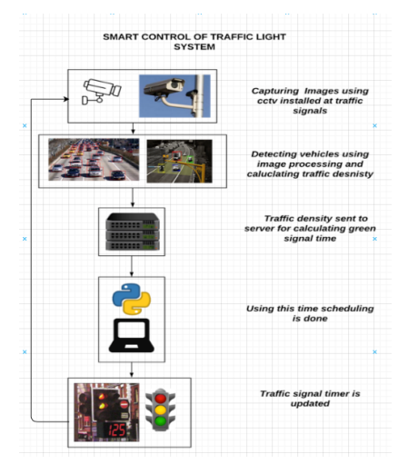
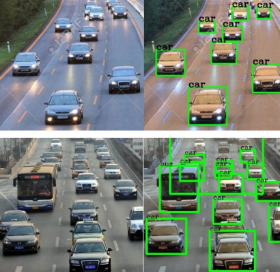
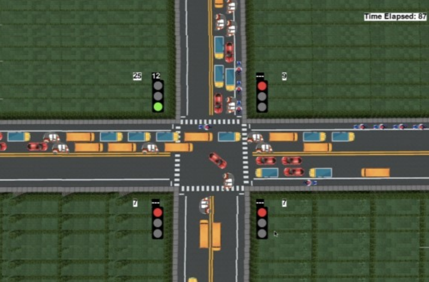
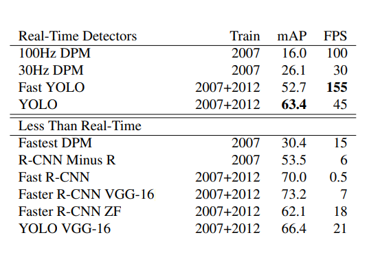
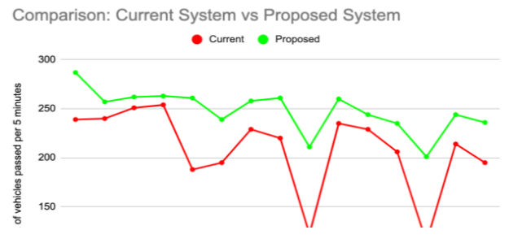
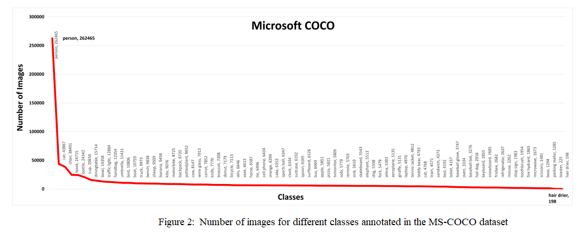

# Real-time-traffic-management-system

## Prerequisites
#### Python 3.7
#### Microsoft Visual C++ build tools (For Windows only)

## Installation

#### Step I: Install the required packages

On the terminal, move into Real-Time Traffic Management System/Code

 $ cd Real-Time Traffic Management System/Code
 
 $ pip install -r requirements.txt
 
 $ python setup.py build_ext –inplace
 
#### Step II: Run the code

To run vehicle detection

 $ python vehicle_detection.py

 To run simulation
 
 $ python simulation.py
 
</img>
</img>
</img>
</img>
</img>
</img>

